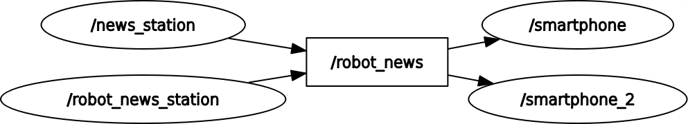

<h1>ROS2 Udemy Course Files</h1>

Edouard Renard's (Robotics Back-end) Udemy course that I took about ROS2

<h2> Small notes that i took along the course </h2>

 - We can modify the topic name of publisher/subscriber on runtime
    - ros2 run py_pkg_example smartphone --ros-args -r robot_news:=new_topic_name
    - ros2 run py_pkg_example robot_news_station --ros-args -r robot_news:=new_topic_name

 - We can also do the same for nodes
    - ros2 run py_pkg_example robot_news_station --ros-args -r __node:=new_node_name

 - Can do these both at the same time too
    - ros2 run cpp_pkg_example robot_news_station --ros-args -r __node:=new_node_name -r robot_news:=new_topic_name

 -> an example for node/topic name remapping

 - ros2 interface show example_interfaces/{msg, srv etc.}/{msg, service, ... etc.'s name} 
    - This line gives us a brief explanation about data type of service, message etc. Quite useful
 
 - ros2 run py_pkg_example sum_server 
 - ros2 service call /sum_service example_interfaces/srv/AddTwoInts "{a: 3, b: 5}"
    - For the services we create the server node, then with self.create_service we create a server for it
    - To use the service in the server we first run the server then we call the service with appropiate service name and 
    give it the inputs that it gets.