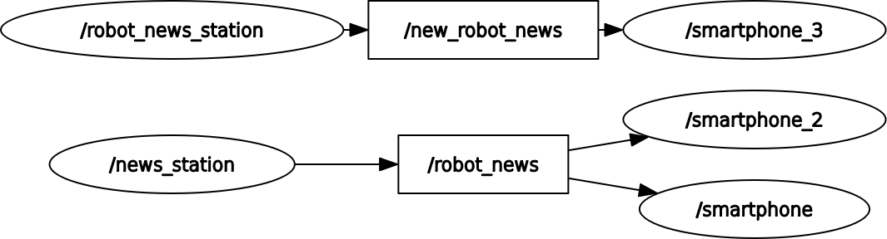

<h1>ROS2 Udemy Course Files</h1>

Edouard Renard's (Robotics Back-end) Udemy course that I took about ROS2

<h2> Small notes that i took along the course </h2>

 - We can modify the topic name of publisher/subscriber on runtime
    - ros2 run py_pkg_example smartphone --ros-args -r robot_news:=new_topic_name
    - ros2 run py_pkg_example robot_news_station --ros-args -r robot_news:=new_topic_name

 - We can also do the same for nodes
    - ros2 run py_pkg_example robot_news_station --ros-args -r __node:=new_node_name

 -> an example for node/topic name remapping